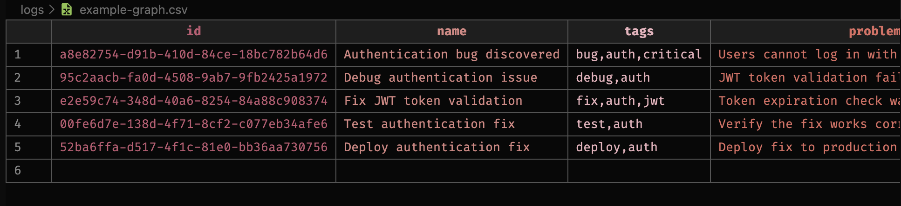

# ☘️ llm-lean-log

LLMとそのエージェントを使用して、ログの書き込みと読み取りを行います。

- Antigravity
- Cursor
- Windsurf
- Claude Code
- Opencode
- または、お好みのLLMクライアント

私の日常的なコーディングニーズから始まり、私はAIエージェントとのチャットセッションを記録するツールを必要としました。これにより、個人的な参考資料やプロジェクトドキュメントとして使用できます。開発者のグループを閲覧している間、複数のマシン間でチャットログを同期し、長期的な履歴を保持するための需要が高まっていることも気づきました。

それが `llm-lean-log-cli` が誕生した理由です：トークン使用量を最小限に抑えるように最適化されたチャット履歴の読み書きのためのツールです。つまり、より少ないトークン数で、それゆえにコストも低くなります。

> 📝 大規模言語モデル（LLM）のためのロギングですが、余分な機能は削除されています。

`llm-lean-log` は、CSVデータに基づく原因と結果の関係を持つ、LLMのトークン使用量を最適化したロギングフォーマットです。

## 🍓 AIエージェント（LLM）にログを書かせる

AIエージェント（LLM）にログを書かせる前に、`llm-lean-log-cli` CLIツールをグローバルにインストールしてください。

```bash
bun add -g llm-lean-log-cli
```

プロンプトでLLMにログを書かせる：

> `l-log add ./logs/chat.csv "バグ修正" --tags=bug,fix --problem="問題の説明" --files="file1.ts,src/file2.ts" --tech-stack="elysia,drizzle,sqlite" --causeIds="uuid1,uuid2" --last-commit-short-sha="abc1234"` CLIツールを使用して上記のチャットログ/会話を保存

またはユーザーにとってはより簡単だがLLMには効率が悪い方法：

> 上記のチャットログを保存するためにl-log CLIを使用

または：

> l-log を使用して保存

## 🍓 AIエージェント（LLM）にログを読ませる

プロンプトでLLMに最後のログのみを読ませる（LLMにとって効率的）：

> `l-log view ./logs/example.csv --last` CLIを実行して出力を読み込む

プロンプトでLLMにすべてのログを読ませる（LLMにとって効率が悪い）：

> "./logs/example.csv"から最新のチャットログを読み込み、次に何をするべきか教えてください

これはLLMがログを読むための効率的な方法です。時間、トークン、エネルギーを節約できます。LLMがログの最後に新しいログを書く前に長いCSVファイルを読む必要がないためです。

## 📚 エージェントにログ記録ルールを追加

たとえば、LLMエージェント設定ファイル（例：`.agent/rules/common.md`）にこのルールを追加できます：

```bash
# Create file
touch .agent/rules/common.md
```

[.agent/rules/common.md](.agent/rules/common.md)ファイルの内容をコピーしてください。

もしLLMsがログを忘れるか、またはユーザーに応答する際にログを書くべきかどうかが不明確な場合は、プロンプトでLLMsにログを書くように要求できます：

> use l-log

## 🌵 MCP Memory

MCP Memoryを使用するには、`l-log-mcp-server`パッケージを使用してください。詳細については、[packages/mcp/README.md](packages/mcp/README.md)と[packages/mcp-server/README.md](packages/mcp-server/README.md)を参照してください。

## ❌ 問題

- 🐥 `markdown` はLLMのトークン使用量を最適化しておらず、人間の可読性のためだけです。
- 🐥 `json` はLLMのトークン使用量を最適化しておらず、機械の可読性のためだけです。
- 🐥 LLMのトークン使用量の最高パフォーマンス。これは純粋な表形式データなので、平面テーブルではCSVの方が`TOON`よりも小さいです。参考：<https://github.com/toon-format/toon?tab=readme-ov-file#when-not-to-use-toon>。
- 🐥 システムロギングのベストプラクティスは多数ありますが、LLMのトークン使用量を最適化しておらず、ログチャットのコンテキストを理解するためのデータ構造が欠けています。
  - 例えば、システムロガーではログレベルWARNINGが使用されますが、LLMが必要とするのは何でしょうか？
- 🐥 LLMが過去のログを読むためのクリーンで予測可能かつシンプルなフォーマット。
- 🐥 LLMがログを書く際には、CLIツールを使用してログを保存すべきです。これにより、LLMがCSVファイル自体を編集する必要がなくなり、時間、トークン、エネルギーを節約できます。
  - 🌳 LLMがログを保存するための効率的な方法が必要です。
- 🐥 人間がCSVログを読む際、私は長いCSVログをより人間にとって分かりやすい方法で表示するツールを望んでいます。
  - 🌳 人間がログを読むための効率的な方法が必要です。
- 🌳 ローカルファースト、完全制御のログおよびプロジェクトドキュメントのストレージで、Cursor、Windsurf、TUIクライアントなどの外部サービスに依存しません。
- 🐥 非常に長く、長く、長い会話履歴がありますが、LLMはそれを数語で要約し、重要な情報のみを保存できます。
  - 🌳 すべての会話履歴を保存しないでください。重要な情報のみを保存します。
- 🌳 推論ベースの、人間のような長文ドキュメント検索が必要です（<https://github.com/VectifyAI/PageIndex>のように）。
  - データは有向非巡回グラフ（<https://ja.wikipedia.org/wiki/%E6%9C%89%E5%90%91%E9%9D%9E%E5%BE%AA%E7%92%B0%E3%82%B0%E3%83%A9%E3%83%95>）または有向循環グラフ（<https://ja.wikipedia.org/wiki/%E6%9C%89%E5%90%91%E3%82%B0%E3%83%A9%E3%83%95>）になります。原因と結果はノード間のリンク - チャットです。

## ✅ 解決策


🪴 ログ用のシンプルで単一の平面CSVデータフォーマットファイルを作成：

- 🌟 ヘッダーはロガーの重要なフィールドです：
  - `id`: ログID（必須）、UUID（一意識別子）、有向グラフ、原因と結果のために使用されます。
  - `name`: ログの主な内容（短い）。（必須）
  - `tags`: ログを分類するタグ、カンマ区切り。例：`error,api,auth`。（オプション）
  - `problem`: 問題の説明、ログのコンテキスト。（必須）
  - `solution`: 解決策の説明、問題を解決する方法。（オプション）
  - `action`: 実行コマンド、問題を解決するために実行されたアクション（ウェブ検索など）。（オプション）
    - 実行コマンドの形式：`text {language}`\`code-block\``
      - 行の値の例：

        ```text
        bash`bun i`を実行; 次にdevサーバーを起動 bash`bun dev`; "src/constants.ts"の定数を更新: ts`const MY_CONSTANT = 'new value';`
        ```

      - 言語はオプションですが、より良い解析のために推奨されます。
      - なぜ？
        - コードのより良い解析と理解。
        - Markdownコードブロック形式から学び、人間がコードを読めるようにします。
    - 形式：`text {language}`\`code-block\`` または markdown code block またはテキスト。
  - `files`: 修正、作成、削除されたファイル、または読む必要があるファイルのリスト（オプション）。
    - 例：`src/index.ts,src/constants.ts`
    - なぜ？
      - コードとログのコンテキストをより良く理解するため。
    - 形式：カンマ区切りのファイルリスト。
  - `tech-stack`: 使用された技術のリスト（オプション）。
    - 例：`elysia,drizzle,sqlite,turso`
    - なぜ？
      - コードとログのコンテキストをより良く理解するため。
    - 形式：カンマ区切りの技術リスト。
  - `cause`: 問題の原因（オプション）。
    - 例：`you choose to use X instead of Y, to do Z`
    - なぜ？
      - ログをより良く理解するため。
    - 形式：テキスト。

  - `causeIds`: ログの原因ログID（オプション）。
    - 例：`UUID,UUID`
    - なぜ？
      - ログをより良く理解するため。
    - 形式：他のログIDのカンマ区切りリスト。

  - `effectIds`: ログの影響ログID（オプション）。
    - 例：`UUID,UUID`
    - なぜ？
      - ログをより良く理解するため。
    - 形式：他のログIDのカンマ区切りリスト。

  - `last-commit-short-sha`: ログの最終gitコミットの短縮SHA（オプション）。
    - 例：`a1b2c3d`
    - なぜ更新されたgitコミットではないのか？
      - gitコミットは通常、LLMがログを書く前に更新されます。
    - 形式：最終コミットの短縮SHA。

  - `created-at`: ログが作成された時刻。（必須）。
    - 形式：`YYYY-MM-DDTHH:mm:ssZ`（ISO 8601）
      - 例：`2025-10-15T12:34:56Z`
      - 人間、マシン、LLMが読めます。
  - `updated-at`: ログが更新された時刻（オプション）。
    - 形式：`YYYY-MM-DDTHH:mm:ssZ`（ISO 8601）
      - 例：`2025-10-15T12:34:56Z`
      - 人間、マシン、LLMが読めます。
  - `model`: 使用されたモデル（オプション）。
    - 例：`gpt-4o-mini`
  - `created-by-agent`: ログ作成に使用されたモデル（オプション）。
    - 例：`gpt-4o-mini`
- 行：
  - 各行はログエントリです。
  - 改行は使用しない、または`\n`を使用し、情報を区切るにはカンマ - `,`、ピリオド - `.`、セミコロン - `;` を使用してください。

## その他の問題

CSV形式は人間にとって親しみにくく、行が長すぎたり、コードブロックサポートがないため、読みにくい場合があります。

### 解決策

`llm-lean-log-cli` CLIツールを使用して、より人間にとって分かりやすい方法でログを表示します。

```bash
bun add -g llm-lean-log-cli
```

## 💻 使用方法

`llm-lean-log-cli` のバイナリ名は `l-log` です。

LLMによるログ表示用（`--human`オプションは不要、出力はCSV形式（+ 空の場合はメタデータ列を自動的に非表示））：

```bash
# すべてのログエントリをリスト、出力はCSV形式
l-log list ./logs/example.csv
```

LLMの期待される出力はCSV形式です：

```text
id,name,tags,problem,solution,action,files,tech-stack,causeIds,created-at,model
auth-error-001,API認証エラー,"error,api,auth",JWTトークンの有効期限切れが正しく処理されていないため、ユーザーがログインできません,指数バックオフ再試行メカニズム付きトークン更新ロジックを追加,auth.tsミドルウェアを更新し、更新エンドポイントを追加,"src/middleware/auth.ts, src/routes/auth.routes.ts","typescript, express, jwt",,2026-01-13T14:52:58.681Z,claude-3.5-sonnet
db-investigation-002,データベース接続プール枯渇,"error,database,performance",高トラフィック時にデータベース接続プールが枯渇したためアプリケーションがクラッシュ,プールサイズを10から50に増加し、接続タイムアウト処理を追加,"database.config.tsを変更: ts`pool.max = 50, pool.idleTimeoutMillis = 30_000`",src/config/database.config.ts,"typescript, postgresql, node.js",auth-error-001,2026-01-13T14:52:58.681Z,gpt-4-turbo
...
```

```bash
# 統計情報を表示
l-log stats ./logs/example.csv

# インデックス位置の詳細エントリを表示
l-log view ./logs/example.csv 0

# 最後のログエントリを表示
l-log view ./logs/example.csv --last
```

LLMの期待される出力はCSV形式です：

```text
id,name,tags,problem,solution,action,files,tech-stack,causeIds,created-at,model
typescript-migration-006,TypeScript移行完了,"refactor,typescript,milestone",コードベースがJavaScriptだったので型エラーをキャッチするのが難しかった,Strictモードで全体のコードベースをTypeScriptに移行,"すべての.jsファイルを.tsに変換、型定義を追加、tsconfig.jsonを設定","tsconfig.json, package.json, src/**/*","typescript, node.js","auth-error-001,memory-leak-004,image-optimization-005",2026-01-13T14:52:58.681Z,gpt-4-turbo
```

```bash
# ログを検索、出力はCSV形式
l-log search ./logs/example.csv "Database"

# タグでフィルター、出力はCSV形式
l-log tags ./logs/example.csv error api

# 新しいログエントリを追加
l-log add ./logs/chat.csv "バグ修正" --tags=bug,fix --problem="問題の説明"
```

人間のユーザーによるログ表示には `--human` オプションを使用：

```bash
# すべてのログエントリをリスト
l-log list ./logs/example.csv --human
# 出力: [色とヘッダー付きの完全な美しいテーブル]

# 統計情報を表示
l-log stats ./logs/example.csv --human

# インデックス位置の詳細エントリを表示
l-log view ./logs/example.csv 0 --human

# ログを検索
l-log search ./logs/example.csv "query" --human

# タグでフィルター
l-log tags ./logs/example.csv tag1 tag2 --human

# 新しいログエントリを追加、ログファイルを指定しない場合、`./logs/example.csv` ログファイルを使用します
l-log add ./logs/example.csv "バグ修正" --tags=bug,fix --problem="問題の説明"
```

## 🐳 人間のためのビジュアライザー

`l-log-vis` (llm-lean-log-visualizer` パッケージ)をグローバルにインストール：

```bash
bun add -g l-log-vis
```

ビジュアライザーを実行：

```bash
l-log-vis ./logs/example.csv
# または
l-log-vis
```

## 🛠️ 開発

- ログ管理のためのCLIツールを追加
- 検索およびフィルタリング機能を追加
- コードハイライト付きの美しいReactベースのWebビジュアライザーを追加、詳細は [Webビジュアライザー](./packages/visualizer/README.md) を参照してください。

依存関係をインストール：

```bash
bun i
```

### 🌈 アプリケーションの実行

🌱 サンプルログを作成してビジュアライザーを実行：

```bash
bun example
```

💻 CLIの使用法：

```bash
# すべてのログエントリをリスト
bun cli list

# すべてのログエントリをリスト（コンパクトビュー）
bun cli ls -c
```

```bash
# 統計情報を表示
bun cli stats
```

スクリーンショット：


```bash
# インデックス位置の詳細エントリを表示
bun cli view 0

# 最後のログエントリを表示
bun cli view --last
```

スクリーンショット：


```bash
# 名前、問題、または解決策でログを検索
bun cli search "memory"
```

スクリーンショット：


```bash
# タグでログをフィルター
bun cli tags error api
```

```bash
# 新しいログエントリを追加
bun cli add "バグ修正" --tags=bug,fix --problem="バグの説明" --solution="問題を修正しました"
# 期待される結果: ログエントリが正常に追加されました

# ヘルプを表示
bun cli help
```

このプロジェクトは、bun v1.3.5で`bun init`を使用して作成されました。[Bun](https://bun.com)は高速なオールインワンJavaScriptランタイムです。

## 📖 追加情報

- ドキュメント公開: `./docs/publish.sh`
- リリースドキュメント: `./docs/release.sh`

詳細は `./docs` フォルダを参照してください。

### 💻 VS Codeベースエディタでの使用

- `.vscode/extensions.json`から推奨拡張機能をインストールしてください。含まれるのは：
  - `DavidAnson.vscode-markdownlint` - Markdown linting
  - `biomejs.biome` - コードフォーマットとlinting
  - `oven-sh.bun` - Bunランタイムサポート
  - `jeff-hykin.better-csv-syntax` - CSV構文ハイライト（カラーコーディング付き）
  - `YoavBls.pretty-ts-errors` - 美しいTypeScriptエラー
  - `ReprEng.csv` - CSVサポート
  


## 📚 カバレッジ状況

`./coverage.txt`

## TODO

- 有向グラフのWebビジュアライザーアプリを改善（原因と結果を表示）。

## 📄 ライセンス

MIT
