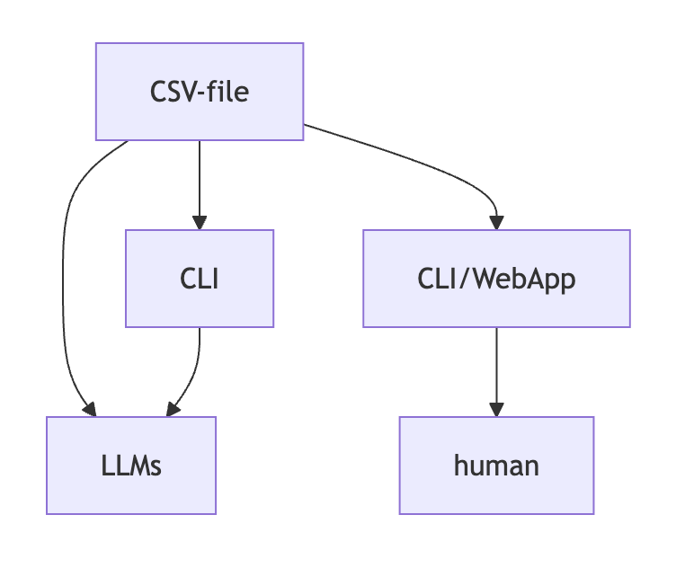
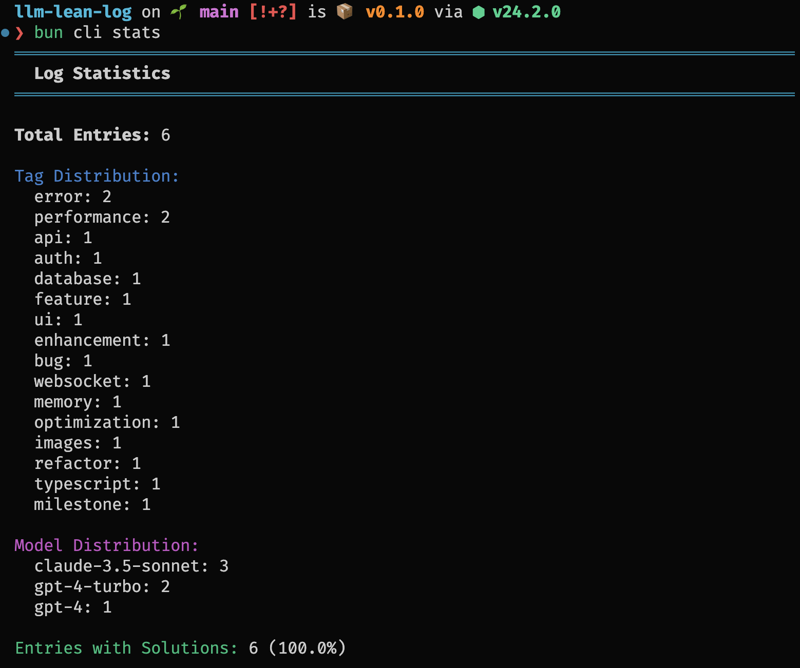
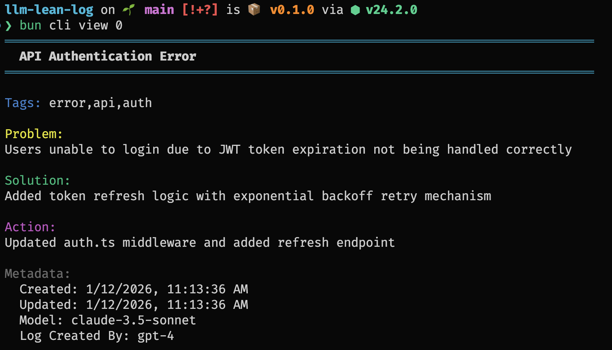
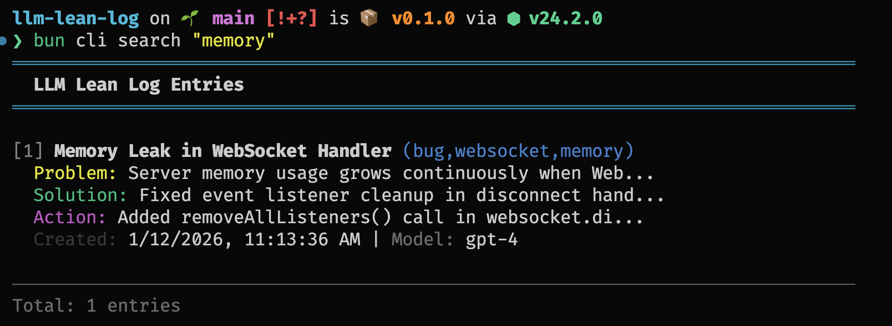

# ☘️ llm-lean-log

Xuất phát từ nhu cầu hàng ngày coding, mình muốn có 1 tool để ghi Chat log với AI Agent để làm tài liệu tra cứu cho bản thân hoặc docs của dự án. Mình lướt thấy trong các group cũng có nhu cầu sync chat log nhiều máy, lưu lịch sử...

Từ đó, `llm-lean-log-cli` là tool đọc, ghi lịch sử chat tối ưu cho lượng token cần sử dụng -> tiết kiệm token -> tiết kiệm tiền.

> 📝 Ghi log cho LLM, nhưng lược bỏ phần dư thừa.

`llm-lean-log` là một định dạng ghi log được tối ưu hóa cho mức tiêu thụ token của LLM (Mô hình ngôn ngữ lớn), thể hiện các mối quan hệ nguyên nhân và kết quả dựa trên dữ liệu CSV.

## 🍓 Yêu cầu AI agent (LLM) viết log

Trước khi bạn yêu cầu AI agent (LLM) viết log, hãy đảm bảo đã cài đặt công cụ CLI `llm-lean-log-cli` trên toàn hệ thống.

```bash
bun add -g llm-lean-log-cli
```

Yêu cầu LLM viết log bằng lệnh:

> sử dụng công cụ CLI `l-log add ./logs/chat.csv "Fix bug" --tags=bug,fix --problem="Mô tả vấn đề"` để lưu log cuộc hội thoại cuối cùng / cuộc nói chuyện ở trên

Hoặc đơn giản hơn cho người dùng nhưng ít hiệu quả hơn cho LLM:

> sử dụng l-log CLI để lưu log hội thoại trên

Hoặc:

> sử dụng l-log để lưu

## 🍓 Yêu cầu AI agent (LLM) đọc log

Yêu cầu LLM chỉ đọc log cuối cùng bằng lệnh (hiệu quả cho LLM):

> chạy CLI `l-log view ./logs/example.csv --last` và đọc kết quả

Yêu cầu LLM đọc tất cả log bằng lệnh (ít hiệu quả hơn cho LLM):

> đọc log hội thoại cuối cùng từ "./logs/example.csv" và cho tôi biết tôi nên làm gì tiếp theo

Đây là một cách hiệu quả để LLM đọc log. Tiết kiệm thời gian, token và năng lượng. Bởi vì LLM không cần phải đọc các tệp CSV dài trước khi có thể viết một log vào cuối phiên làm việc.

## ❌ Các vấn đề

- 🐥 `markdown` không được tối ưu cho việc sử dụng token của LLM, chỉ phục vụ cho việc con người đọc.
- 🐥 `json` không được tối ưu cho việc sử dụng token của LLM, chỉ phục vụ cho việc máy đọc.
- 🐥 Về hiệu suất, CSV và `TOON` có hiệu suất tối ưu nhất cho việc sử dụng token của LLM. Đối với dữ liệu bảng thuần túy, CSV tốt hơn `TOON` đối với các bảng dữ liệu phẳng. Tham khảo <https://github.com/toon-format/toon?tab=readme-ov-file#when-not-to-use-toon>.
- 🐥 Có nhiều quy chuẩn (best practices) cho việc ghi log hệ thống, nhưng chúng không được tối ưu cho việc tiêu thụ token của LLM và thiếu cấu trúc dữ liệu để hiểu ngữ cảnh của cuộc hội thoại log.
  - Ví dụ, log level WARNING được sử dụng cho log hệ thống, nhưng LLM thực sự cần biết điều gì?
- 🐥 Định dạng sạch sẽ, dễ dự đoán và đơn giản để LLM đọc lại lịch sử log của các phiên làm việc trước đó.
- 🐥 Khi LLM viết log, nên sử dụng công cụ CLI để lưu log, để LLM không cần phải tự sửa tệp CSV, giúp tiết kiệm thời gian, token và năng lượng.
  - 🌳 Chúng ta cần một cách hiệu quả để lưu log cho LLM.
- 🐥 Khi con người đọc log CSV, tôi muốn có một công cụ để xem các log CSV dài một cách thân thiện hơn.
  - 🌳 Chúng ta cần một cách hiệu quả để con người đọc log.
- 🌳 Một kho lưu trữ dữ liệu ưu tiên cục bộ (local first), toàn quyền kiểm soát cho các bản log, tài liệu dự án, không phụ thuộc vào các dịch vụ bên ngoài như Cursor, Windsurf, TUI client, v.v.
- 🐥 Lịch sử hội thoại rất, rất dài, nhưng LLM có thể tóm tắt nó trong vài từ và chỉ lưu lại những thông tin quan trọng.
  - 🌳 Không lưu lại toàn bộ lịch sử hội thoại, chỉ lưu những thông tin quan trọng.
- 🌳 Chúng ta cần một cách truy xuất dựa trên suy luận, giống như con người trên các tài liệu dài (giống như <https://github.com/VectifyAI/PageIndex>).
  - Dữ liệu có thể là Đồ thị có hướng không chu trình (Directed Acyclic Graph - <https://en.wikipedia.org/wiki/Directed_acyclic_graph>) hoặc Đồ thị có hướng có chu trình (Directed cyclic Graph - <https://en.wikipedia.org/wiki/Directed_graph>). Nguyên nhân và kết quả là liên kết giữa các nút - các cuộc hội thoại.

## ✅ Giải pháp



🪴 Tạo một tệp định dạng dữ liệu CSV đơn giản, duy nhất và phẳng cho các log:

- 🌟 Các tiêu đề (Headers) là những trường quan trọng của logger:
  - `id`: ID của log (bắt buộc), UUID để định danh duy nhất, được sử dụng cho Đồ thị có hướng, nguyên nhân và kết quả.
  - `name`: nội dung chính của log (ngắn gọn). (bắt buộc)
  - `tags`: các thẻ để phân loại log, phân tách bằng dấu phẩy. Ví dụ: `error,api,auth`. (tùy chọn)
  - `problem`: mô tả vấn đề, ngữ cảnh của log. (bắt buộc)
  - `solution`: mô tả giải pháp, phương pháp để khắc phục vấn đề. (tùy chọn)
  - `action`: lệnh chạy, hành động (tìm kiếm web, v.v.) đã được thực hiện để giải quyết vấn đề. (tùy chọn)
    - định dạng lệnh chạy: `văn bản {ngôn-ngữ}`\`khối-mã\``
      - Ví dụ về giá trị một hàng:

        ```text
        run bash`bun i`; then start dev server bash`bun dev`; update constants in "src/constants.ts": ts`const MY_CONSTANT = 'new value';`
        ```

      - Ngôn ngữ là tùy chọn, nhưng được khuyến nghị để phân tích cú pháp tốt hơn.
      - Tại sao?
        - Giúp phân tích và hiểu mã tốt hơn.
        - Học hỏi từ định dạng khối mã của Markdown, để con người có thể đọc và hiểu mã.
  - `files`: danh sách các tệp đã được sửa đổi, tạo mới, xóa hoặc phải đọc (tùy chọn).
    - Ví dụ: `src/index.ts,src/constants.ts`
    - Tại sao?
      - Giúp hiểu mã và ngữ cảnh của log tốt hơn.
    - Định dạng: danh sách các tệp phân tách bằng dấu phẩy.
  - `tech-stack`: danh sách các công nghệ đã được sử dụng (tùy chọn).
    - Ví dụ: `elysia,drizzle,sqlite,turso`
    - Tại sao?
      - Giúp hiểu mã và ngữ cảnh của log tốt hơn.
    - Định dạng: danh sách các công nghệ phân tách bằng dấu phẩy.

  - `causeIds`: ID log nguyên nhân của log này (tùy chọn).
    - Ví dụ: `UUID,UUID`
    - Tại sao?
      - Giúp hiểu log tốt hơn.
    - Định dạng: danh sách các ID log khác phân tách bằng dấu phẩy.

  - `effectIds`: ID log kết quả của log này (tùy chọn).
    - Ví dụ: `UUID,UUID`
    - Tại sao?
      - Giúp hiểu log tốt hơn.
    - Định dạng: danh sách các ID log khác phân tách bằng dấu phẩy.

  - `last-commit-short-sha`: SHA ngắn của git commit cuối cùng của log (tùy chọn).
    - Ví dụ: `a1b2c3d`
    - Tại sao không cập nhật git commit?
      - git commit thường được cập nhật trước khi LLM viết log.
    - Định dạng: SHA ngắn của commit cuối cùng.

  - `created-at`: thời điểm log được tạo. (bắt buộc).
    - Định dạng: `YYYY-MM-DDTHH:mm:ssZ` (ISO 8601)
      - Ví dụ: `2025-10-15T12:34:56Z`
      - Có thể đọc được bởi con người, máy móc và LLM.
  - `updated-at`: thời điểm log được cập nhật (tùy chọn).
    - Định dạng: `YYYY-MM-DDTHH:mm:ssZ` (ISO 8601)
      - Ví dụ: `2025-10-15T12:34:56Z`
      - Có thể đọc được bởi con người, máy móc và LLM.
  - `model`: mô hình đã được sử dụng (tùy chọn).
    - Ví dụ: `gpt-4o-mini`
  - `created-by-agent`: mô hình đã được sử dụng để tạo log (tùy chọn).
    - Ví dụ: `gpt-4o-mini`
- Hàng (Row):
  - Mỗi hàng là một mục nhập log.
  - Không sử dụng dòng mới, hoặc sử dụng `\n`, chỉ sử dụng dấu phẩy - `,`, dấu chấm - `.`, dấu chấm phẩy - `;` để phân tách thông tin.

## Các vấn đề khác

Định dạng CSV đôi khi khó đọc vì nó không thân thiện với con người, dòng quá dài, không hỗ trợ khối mã (code-blocks).

### Giải pháp

Sử dụng công cụ CLI `llm-lean-log-cli` để xem log theo cách thân thiện với con người hơn.

```bash
bun add -g llm-lean-log-cli
```

## 💻 Cách sử dụng

Tên tệp thực thi của `llm-lean-log-cli` là `l-log`.

Đối với LLM khi xem log (không cần tùy chọn `--human`, đầu ra là định dạng CSV (+ tự động ẩn các cột Metadata nếu trống)):

```bash
# Liệt kê tất cả các mục log, đầu ra là định dạng CSV
l-log list ./logs/example.csv
```

Đầu ra mong đợi ở định dạng CSV cho LLM:

```text
id,name,tags,problem,solution,action,files,tech-stack,causeIds,created-at,model
auth-error-001,API Authentication Error,"error,api,auth",Users unable to login due to JWT token expiration not being handled correctly,Added token refresh logic with exponential backoff retry mechanism,Updated auth.ts middleware and added refresh endpoint,"src/middleware/auth.ts, src/routes/auth.routes.ts","typescript, express, jwt",,2026-01-13T14:52:58.681Z,claude-3.5-sonnet
db-investigation-002,Database Connection Pool Exhausted,"error,database,performance",Application crashes during high traffic due to database connection pool being exhausted,Increased pool size from 10 to 50 and added connection timeout handling,"Modified database.config.ts: ts`pool.max = 50, pool.idleTimeoutMillis = 30_000`",src/config/database.config.ts,"typescript, postgresql, node.js",auth-error-001,2026-01-13T14:52:58.681Z,gpt-4-turbo
...
```

```bash
# Hiển thị số liệu thống kê
l-log stats ./logs/example.csv

# Xem chi tiết mục tại một chỉ mục
l-log view ./logs/example.csv 0

# Xem mục log cuối cùng
l-log view ./logs/example.csv --last
```

Đầu ra mong đợi ở định dạng CSV cho LLM:

```text
id,name,tags,problem,solution,action,files,tech-stack,causeIds,created-at,model
typescript-migration-006,TypeScript Migration Complete,"refactor,typescript,milestone",Codebase was in JavaScript making it hard to catch type errors,Migrated entire codebase to TypeScript with strict mode enabled,"Converted all .js files to .ts, added type definitions, configured tsconfig.json","tsconfig.json, package.json, src/**/*","typescript, node.js","auth-error-001,memory-leak-004,image-optimization-005",2026-01-13T14:52:58.681Z,gpt-4-turbo
```

```bash
# Tìm kiếm log, đầu ra là định dạng CSV
l-log search ./logs/example.csv "Database"

# Lọc theo thẻ, đầu ra là định dạng CSV
l-log tags ./logs/example.csv error api

# Thêm một mục log mới
l-log add ./logs/chat.csv "Fix bug" --tags=bug,fix --problem="Mô tả vấn đề"
```

Dành cho người dùng là con người khi xem log với tùy chọn `--human`:

```bash
# Liệt kê tất cả các mục log
l-log list ./logs/example.csv --human
# Kết quả: [Bảng đẹp đầy đủ với màu sắc và tiêu đề]

# Hiển thị số liệu thống kê
l-log stats ./logs/example.csv --human

# Xem chi tiết mục nhập tại chỉ mục
l-log view ./logs/example.csv 0 --human

# Tìm kiếm log
l-log search ./logs/example.csv "truy vấn" --human

# Lọc theo thẻ
l-log tags ./logs/example.csv tag1 tag2 --human

# Thêm một mục log mới
l-log add ./logs/example.csv "Fix bug" --tags=bug,fix --problem="Mô tả vấn đề"
```

## 🐳 Trình trực quan hóa cho con người

Cài đặt gói `l-log-vis` (llm-lean-log-visualizer`) trên toàn hệ thống:

```bash
bun add -g l-log-vis
```

Chạy trình trực quan hóa:

```bash
l-log-vis ./logs/example.csv
# hoặc
l-log-vis
```

## 🛠️ Phát triển

- Đã thêm công cụ CLI để quản lý log
- Đã thêm khả năng tìm kiếm và lọc
- Đã thêm Trình trực quan hóa Web dựa trên React đẹp mắt với khả năng làm nổi bật mã, xem thêm tại [Web Visualizer](./packages/visualizer/README.md).

Để cài đặt các phụ thuộc:

```bash
bun i
```

### 🌈 Chạy Ứng dụng

🌱 Tạo các log ví dụ và chạy trình trực quan hóa:

```bash
bun example
```

💻 Sử dụng CLI:

```bash
# Liệt kê tất cả các mục log
bun cli list

# Liệt kê tất cả các mục log (dạng thu gọn)
bun cli ls -c
```

```bash
# Hiển thị số liệu thống kê
bun cli stats
```

Ảnh chụp màn hình:



```bash
# Xem chi tiết mục tại chỉ mục
bun cli view 0

# Xem mục log cuối cùng
bun cli view --last
```

Ảnh chụp màn hình:



```bash
# Tìm kiếm log theo tên, vấn đề hoặc giải pháp
bun cli search "memory"
```

Ảnh chụp màn hình:



```bash
# Lọc log theo thẻ
bun cli tags error api
```

```bash
# Thêm một mục log mới
bun cli add "Fix bug" --tags=bug,fix --problem="Mô tả lỗi" --solution="Đã sửa lỗi"
# kết quả mong đợi: Log entry added successfully

# Hiển thị trợ giúp
bun cli help
```

Dự án này được tạo bằng `bun init` trong bun v1.3.5. [Bun](https://bun.com) là một môi trường thực thi JavaScript tất cả trong một cực nhanh.

## 📚 Thêm quy tắc cho agent ghi log

Ví dụ, bạn có thể thêm quy tắc này vào tệp cấu hình agent của bạn (ví dụ: `.agent/rules/common.md`):

```md
---
trigger: always_on
---

# Common rules for LLM agent

Whenever you finish a task, always log your work using the l-log tool (llm-lean-log-cli package).

Use the following format:

```bash
l-log add ./logs/chat.csv "<Task Name>" --tags="<tags>" --problem="<problem>" --solution="<solution>" --action="<action>" --files="<files>" --tech-stack="<tech>" --last-commit-short-sha=$(git rev-parse --short HEAD) --created-by-agent="<agent-name>"
```

More info: <https://github.com/loclv/llm-lean-log>.

```

## 📖 Thông tin bổ sung

- Tài liệu công bố: `./docs/publish.sh`
- Tài liệu phát hành: `./docs/release.sh`

Xem thêm tại `./docs` folder.

### 💻 Sử dụng với trình soạn thảo dựa trên VS Code

- Cài đặt các tiện ích mở rộng được khuyến nghị từ `.vscode/extensions.json`, bao gồm:
  - `DavidAnson.vscode-markdownlint` - Kiểm tra lỗi Markdown
  - `biomejs.biome` - Định dạng và kiểm tra lỗi mã
  - `oven-sh.bun` - Hỗ trợ môi trường thực thi Bun
  - `jeff-hykin.better-csv-syntax` - Làm nổi bật cú pháp CSV (với mã hóa màu sắc)
  - `YoavBls.pretty-ts-errors` - Hiển thị lỗi TypeScript đẹp hơn

## 📚 Trạng thái độ bao phủ (Coverage) Unit Test

```text
----------------------------------|---------|---------|-------------------
Tệp                               | % Hàm   | % Dòng  | Số dòng chưa bao phủ
----------------------------------|---------|---------|-------------------
Tất cả các tệp                    |   98.18 |   96.26 |
 packages/core/src/csv-utils.ts   |  100.00 |   99.29 | 
 packages/core/src/graph-utils.ts |   96.88 |   96.83 | 243,308-314
 packages/core/src/logger.ts      |  100.00 |   92.00 | 20,22-25
 packages/core/src/visualizer.ts  |   95.83 |   96.90 | 54-55,77-78,100-101,126-127,140-141
----------------------------------|---------|---------|-------------------
```

## VIỆC CẦN LÀM (TODO)

- Cải thiện ứng dụng web trực quan hóa cho Đồ thị có hướng (hiển thị nguyên nhân và kết quả).

## 📄 Giấy phép

MIT
