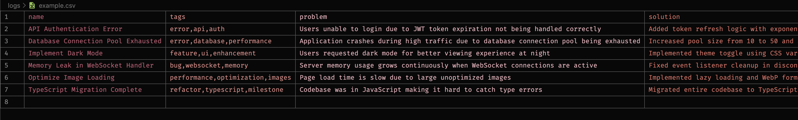
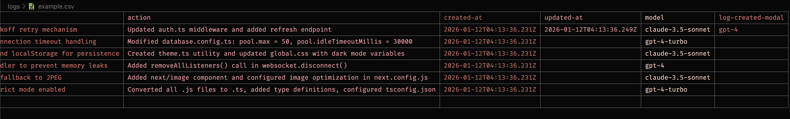

# llm-lean-log

> 📝 Logging for LLMs, but we cut the fat.

`llm-lean-log` is a format for logging that is optimized for LLMs token usage.

## 📊 Format Examples

Here are visual examples of the CSV logs format:

**Example - part 1:**


**Example - part 2:**


## ❌ Problems

- `markdown` is not optimized for LLMs token usage, only for human readability.
- `json` is not optimized for LLMs token usage, only for machine readability.
- Best performance of LLMs token usage. This is pure tabular data, so CSV is smaller than `TOON` for flat tables. Refer to <https://github.com/toon-format/toon?tab=readme-ov-file#when-not-to-use-toon>.
- There are many best practices for system logging, but they are not optimized for LLMs token usage.
- Clean, predictable and simple format for LLMs to read past seasons of logs.

## ✅ Solution

- Format is a simple tabular data - CSV.
- Headers are logger important fields:
  - `name`: main content of the log (short). (required)
  - `tags`: tags to categorize the log, comma separated. Example: `error,api,auth`. (optional)
  - `problem`: description of the problem, context of the log. (required)
  - `solution`: description of the solution, method to fix the problem. (optional)
  - `action`: run command, action (web search, etc.) that was taken to fix the problem. (optional)
  - `created-at`: when the log was created. (required)
  - `updated-at`: when the log was updated (optional).
  - `model`: model that was used (optional).
  - `log-created-modal`: model that was used to create the log (optional).

## 🛠️ Development

- Added CLI tool for managing logs
- Added CSV export functionality
- Added search and filter capabilities

To install dependencies:

```bash
bun install
```

### 🚀 Running the Application

🌱 Create example logs and run visualizer:

```bash
bun run index.ts
```

💻 CLI Usage:

```bash
# List all log entries
bun cli list
```

```bash
# Show statistics
bun cli stats
```

Screenshots:


```bash
# View detailed entry at index
bun cli view 0
```

Screenshots:


```bash
# Search logs by name, problem, or solution
bun cli search "memory"
```

Screenshots:


```bash
# Filter logs by tags
bun cli tags error api
```

```bash
# Add a new log entry
bun cli add "Fix bug" --tags=bug,fix --problem="Bug description" --solution="Fixed the issue"
# expected: Log entry added successfully

# Show help
bun cli help
```

This project was created using `bun init` in bun v1.3.5. [Bun](https://bun.com) is a fast all-in-one JavaScript runtime.

## 📖 Additional information

### 💻 Use with VS Code base editor

- Install recommended extensions from `.vscode/extensions.json`, which includes:
  - `DavidAnson.vscode-markdownlint` - Markdown linting
  - `biomejs.biome` - Code formatting and linting
  - `oven-sh.bun` - Bun runtime support
  - `jeff-hykin.better-csv-syntax` - CSV syntax highlighting (with color coding)
  - `YoavBls.pretty-ts-errors` - Pretty TypeScript errors

## 📄 License

MIT
