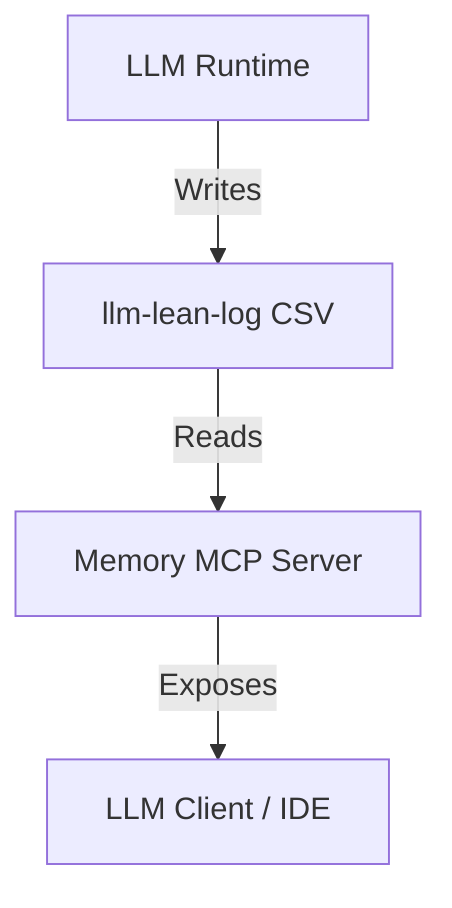

# Memory MCP Design

## Overview

Memory MCP serves as the bridge between raw `llm-lean-log` telemetry and LLM "memory". It transforms high-frequency structured logs into a queryable, durable narrative that allows agents to recall past decisions, errors, and context.

## Architecture

## Core Components

### 1. Log Ingestion Adapter

- **Source**: Reads standard `llm-lean-log` CSV files (typically from `./logs/chat.csv`).
- **Mechanism**:
  - Efficient extraction of last N lines.
  - Parsing of CSV structure including quoted multi-line fields.
  - Optional: File watcher for real-time updates.

### 2. Memory Layer (The "Brain")

This layer abstracts the raw CSV rows into meaningful concepts:

- **Index**: Mappings of `Task Name` -> `Session ID` -> Log Entries.
- **Recall**: Heuristics to find relevant past logs (e.g., "features implemented last week").
- **Summarization**: transforming detailed trace logs into high-level summaries for context.

### 3. MCP Interface

Implements the [Model Context Protocol](https://modelcontextprotocol.io/) to expose data:

#### Resources (Passive Context)

- `memory://latest`: View the last 50 log entries.
- `memory://summary`: A generated summary of the current day's work.
- `memory://stats`: Token usage and cost metrics.

#### Tools (Active Querying)

- `search_memory(query: string, limit: number)`: Search through past logs for specific strings, error messages, or topics.
- `get_task_history(task_name: string)`: Retrieve all logs related to a specific task name.
- `read_session(session_id: string)`: detailed view of a specific conversation flow.

#### Prompts

- `analyze_mistakes`: "Review recent logs and identify the cause of the last failure."
- `catch_up`: "Summarize what was done in the previous session."

## Data Flow

1. **Agent** performs actions; `llm-lean-log` writes to `chat.csv`.
2. **User** asks: "Why did the build fail earlier?"
3. **LLM Client** (via MCP) calls `search_memory("build fail")`.
4. **Memory MCP** parses CSV, filters for "build fail", and returns structured context.
5. **LLM** answers based on the retrieved "memory".

## Goals

- **Auditability**: Trace back _why_ a decision was made.
- **Continuity**: seamless transition between sessions.
- **Analytics**: Understand token burn and tool usage patterns over time.
